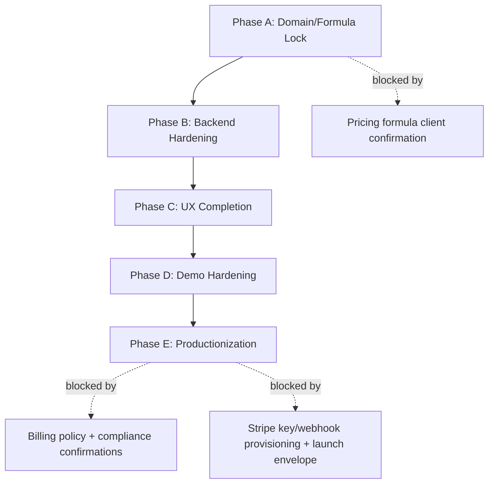

# Remodelator vNext Architecture

Last updated: February 24, 2026
Audience: technical founder, lead engineer, implementation team
Spec authority: current implementation + active docs in root/docs (`notes/*` treated as historical archive only)

Related docs:
- [Docs Index](/Users/dylan/Documents/remodelator-main/docs/README.md)
- [Technical Decisions](/Users/dylan/Documents/remodelator-main/docs/TECH_DECISIONS.md)
- [API Reference (maintained)](/Users/dylan/Documents/remodelator-main/docs/API_REFERENCE.md)
- [API Endpoints (generated)](/Users/dylan/Documents/remodelator-main/docs/API_ENDPOINTS_GENERATED.md)
- [UI/UX Interactions](/Users/dylan/Documents/remodelator-main/docs/UI_UX_INTERACTIONS.md)
- [Blockers and Roadmap](/Users/dylan/Documents/remodelator-main/docs/BLOCKERS_AND_ROADMAP.md)

## 1) System Purpose

Remodelator vNext is an API-first estimating platform for remodeling workflows, delivered with:
- deterministic pricing,
- complete local demo capability (LLM paths require OpenRouter connectivity),
- full UI control for all core workflows,
- simulation-first billing plus OpenRouter-required LLM,
- production-ready seams for auth, billing, and deployment.

Primary outcome:
- a lean, maintainable codebase that is ready for production hardening without replatforming.

## 2) Architecture Principles

1. Domain logic in backend only.
2. Decimal money math only (no float business math).
3. Simulation where explicitly scoped (billing); fail-loud external dependency for LLM.
4. UI is a typed API client, not a second business-logic layer.
5. Security defaults should be safe (token auth, constrained file IO, secret-based config).
6. Determinism and testability over cleverness.

## 3) High-Level System

```mermaid
flowchart LR
  U[User] --> W[React Web UI]
  W -->|HTTP JSON| A[FastAPI]
  A --> S[Application Services]
  S --> D[(SQLite / PostgreSQL)]
  S --> L[LLM Adapter\nOpenRouter (Required)]
  S --> B[Billing Simulation Ledger]
  A --> ADM[Admin Endpoints]
```

## 4) Repository Structure

- `src/remodelator/domain`
  - Pricing rules and deterministic calculations.
- `src/remodelator/application`
  - Use-case orchestration and business workflows.
- `src/remodelator/infra`
  - DB models, auth token utilities, integration adapters (LLM).
- `src/remodelator/interfaces/api`
  - FastAPI HTTP contracts.
- `src/remodelator/interfaces/cli`
  - Operational CLI (including migration SQL dry-run analysis, snapshot reconciliation diff commands, and SQLite integrity checks).
- `apps/web`
  - React TypeScript client (panel-based workflow shell).
- `tests`
  - Backend unit/integration/security tests.
- `apps/web/e2e`
  - Playwright end-to-end workflow tests.

## 5) Runtime Components

### Backend
- Framework: FastAPI + SQLAlchemy + Pydantic
- Entrypoint: `src/remodelator/interfaces/api/main.py` (thin bootstrap)
- App factory: `src/remodelator/interfaces/api/app_factory.py` (`create_api_app`)
- API middleware:
  - CORS allowlist (config-driven),
  - secure response headers (`X-Content-Type-Options`, `X-Frame-Options`, `Referrer-Policy`, `Permissions-Policy`),
  - request tracing (`X-Request-ID`) with per-request structured logs,
  - config-driven sliding-window rate limiting (`429` + `Retry-After` when exceeded).
  - normalized error envelope for non-2xx responses (`detail` + `error{code,message,status}` + `request_id`).
- API lifespan:
  - explicit shutdown disposal of SQLAlchemy engine for deterministic process teardown.
- Router domains: `src/remodelator/interfaces/api/routes/*` (system, auth/profile, estimates, catalog/templates, proposals, billing, llm, activity/backup, admin)
- Estimates routing is internally split by concern (`estimates_base.py`, `estimate_line_items.py`) behind a stable top-level `estimates` router.
- Proposal, billing, and llm routes are internally split (`proposals.py`, `billing.py`, `llm.py`) behind a stable top-level aggregation router.
- Migration/reconciliation logic is isolated in `src/remodelator/application/migration_reconcile.py` and re-exposed through the service layer.
- Estimate/line-item serialization is isolated in `src/remodelator/application/serializers.py` and reused by service workflows.
- Auth/session/password policy logic is isolated in `src/remodelator/application/auth_security.py` and reused by service/auth dependencies.
- LLM provider-status and suggestion-clamp policy logic is isolated in `src/remodelator/application/llm_policy.py`.
- Billing policy, adapter selection, and provider runtime dispatch are isolated in:
  - `src/remodelator/application/billing_policy.py`
  - `src/remodelator/application/billing_adapters.py`
  - `src/remodelator/application/billing_runtime.py`
- Demo reset rebuild logic is centralized in `src/remodelator/application/service.py::rebuild_demo_database` and reused by both API and CLI admin flows.
- Data session handling: `src/remodelator/infra/db.py`
- Contract enforcement: strict request models (`extra=forbid`) and explicit response models on health/auth/profile/admin routes.

### Web Client
- Framework: React + TypeScript + Vite
- Entrypoint: `apps/web/src/App.tsx`
- App controller orchestration: `apps/web/src/lib/useAppController.ts` (state, loaders, action wiring, panel prop assembly)
- Navigation model: panel switcher (`Session`, `Workspace`, `Catalog + Templates`, `Billing + Output`, `Admin + Logs`)
- Action/data modules: `apps/web/src/lib/*Actions.ts` + `dataLoaders.ts` to keep API workflow logic outside component rendering
- Lifecycle/state hooks: `useSessionBootstrap.ts`, `useEstimateSelectionSync.ts`, `useWorkspaceForms.ts`, `useProfileState.ts`, `useSessionStorage.ts`, `useCatalogState.ts`, `useOutputState.ts`, `useAuthState.ts`, `useLlmState.ts`, `useWorkspaceCoreState.ts`
- Panel props are assembled directly in `useAppController.ts` to avoid pass-through wrapper indirection.
- Panel composition boundary: `apps/web/src/components/MainPanels.tsx`
- Panel decomposition examples:
  - workspace detail sections split into `apps/web/src/panels/workspace/*`
  - session sections split into `apps/web/src/panels/session/*`
  - catalog sections split into `apps/web/src/panels/catalog/*`
  - output sections split into `apps/web/src/panels/output/*`
  - admin result rendering split into `apps/web/src/panels/admin/AdminResultView.tsx`

### Data Store
- Local demo default: SQLite under `data/`
- Production baseline: hardened SQLite under `data/`
- Optional scale/compliance track: PostgreSQL compatibility path
- Engine hardening:
  - `pool_pre_ping` enabled for safer long-lived DB connections.
  - SQLite enforces `PRAGMA foreign_keys=ON`, configurable journal mode, synchronous mode, and busy timeout.
  - Admin destructive operations use a cross-process file lock with configurable timeout to prevent reset/prune races.

## 6) Domain Model (Core Concepts)

- User
  - profile defaults: labor rate, default markups, tax.
- Estimate
  - status lifecycle: `draft`, `in_progress`, `completed`, `locked`.
  - version field for clone/version actions.
- EstimateLineItem
  - quantity, unit price, markup, discount, labor, group, computed total.
- CatalogNode / CatalogItem
  - reusable estimate input library.
- Template / TemplateLineItem
  - snapshot/reuse line-item sets.
- BillingEvent + IdempotencyRecord
  - simulation ledger and replay safety.
- AuditEvent
  - action traceability.

## 7) Pricing Engine Behavior

Current line-item calculation order in implementation:
1. base = unit price × quantity
2. item-level markup
3. estimate-level markup
4. discount (fixed or percent)
5. labor hours × labor rate inclusion
6. tax on taxable subtotal

All monetary outputs are quantized Decimal values.

## 8) Authentication and Authorization

### User auth
- `POST /auth/register` and `POST /auth/login` return `session_token`.
- Protected routes require `x-session-token`.
- Legacy `x-user-id` header is disabled by default (`REMODELATOR_ALLOW_LEGACY_USER_HEADER=false`).

### Token design
- Stateless HMAC-signed token payload includes `uid`, `iat`, `exp`.
- Secret configured by `REMODELATOR_SESSION_SECRET`.
- TTL configurable by `REMODELATOR_SESSION_TTL_SECONDS`.

### Password security
- New passwords: PBKDF2-SHA256 with per-user random salt.
- Legacy SHA-256 hashes are supported for login migration and auto-upgraded on successful login.
- Password policy: 8 to 128 characters.

### Admin auth
- Admin read routes allow either:
  - valid `x-admin-key`, or
  - admin-role `x-session-token` (`REMODELATOR_ADMIN_USER_EMAILS`).
- `POST /admin/demo-reset` and `POST /admin/audit-prune` require `x-admin-key`.
- Production mode rejects default `local-admin-key`.

## 9) Configuration Surface

Important env vars:

- Runtime
  - `REMODELATOR_ENV` (`local` or `production`)
  - `REMODELATOR_DATA_DIR`
  - `REMODELATOR_DB_URL`
  - `REMODELATOR_SQLITE_JOURNAL_MODE`
  - `REMODELATOR_SQLITE_SYNCHRONOUS`
  - `REMODELATOR_SQLITE_BUSY_TIMEOUT_MS`
  - `REMODELATOR_OPERATION_LOCK_TIMEOUT_SECONDS`

- Auth
  - `REMODELATOR_SESSION_SECRET`
  - `REMODELATOR_SESSION_TTL_SECONDS`
  - `REMODELATOR_ALLOW_LEGACY_USER_HEADER`
  - `REMODELATOR_ADMIN_API_KEY`
  - `REMODELATOR_ADMIN_USER_EMAILS`

- API Limits
  - `REMODELATOR_API_LIMIT_MAX` (global max cap for list endpoints)
  - `REMODELATOR_CORS_ORIGINS` (comma-separated allowed origins)
  - `REMODELATOR_API_RATE_LIMIT_ENABLED`
  - `REMODELATOR_API_RATE_LIMIT_WINDOW_SECONDS`
  - `REMODELATOR_API_RATE_LIMIT_PUBLIC_MAX`
  - `REMODELATOR_API_RATE_LIMIT_AUTHENTICATED_MAX`
  - `REMODELATOR_AUDIT_RETENTION_DAYS`

- Billing
  - `REMODELATOR_BILLING_ANNUAL_SUBSCRIPTION_AMOUNT`
  - `REMODELATOR_BILLING_REALTIME_PRICING_AMOUNT`
  - `REMODELATOR_BILLING_CURRENCY`
  - `REMODELATOR_BILLING_PROVIDER` (`simulation` or `stripe`)
  - `STRIPE_SECRET_KEY`
  - `STRIPE_WEBHOOK_SECRET`

- LLM
  - `OPENROUTER_API_KEY`
  - `OPENROUTER_MODEL`
  - `OPENROUTER_TIMEOUT_SECONDS`
  - `OPENROUTER_MAX_RETRIES`
  - `OPENROUTER_RETRY_BACKOFF_SECONDS`
  - `REMODELATOR_LLM_PRICE_CHANGE_MAX_PCT`

## 10) API Reference (Exhaustive)

Auth requirement legend:
- `Public`: no user token needed
- `User`: requires `x-session-token`
- `Admin`: read = admin key or admin-role session token; reset = admin key

### Platform / bootstrap

| Method | Path | Auth | Purpose |
|---|---|---|---|
| GET | `/health` | Public | Liveness + DB ping check |
| POST | `/db/migrate` | Public | Create schema (local/dev only; blocked in production) |
| POST | `/db/seed` | Public | Seed catalog (local/dev only; blocked in production) |

### Auth / profile

| Method | Path | Auth | Purpose |
|---|---|---|---|
| POST | `/auth/register` | Public | Create user + return session token |
| POST | `/auth/login` | Public | Login + return session token |
| GET | `/profile` | User | Read profile defaults |
| PUT | `/profile` | User | Update profile defaults |

### Estimates

| Method | Path | Auth | Purpose |
|---|---|---|---|
| POST | `/estimates` | User | Create estimate |
| GET | `/estimates` | User | List estimates |
| GET | `/estimates/{estimate_id}` | User | Read estimate with lines |
| PUT | `/estimates/{estimate_id}` | User | Update estimate metadata |
| POST | `/estimates/{estimate_id}/status` | User | Set status |
| POST | `/estimates/{estimate_id}/unlock` | User | Unlock locked estimate |
| POST | `/estimates/{estimate_id}/duplicate` | User | Duplicate estimate |
| POST | `/estimates/{estimate_id}/version` | User | Create version clone |
| POST | `/estimates/{estimate_id}/recalc` | User | Recalculate totals |
| POST | `/estimates/{estimate_id}/quickstart` | User | Add starter line items from a catalog room |
| POST | `/estimates/{estimate_id}/export` | User | Export estimate JSON (data-dir constrained path) |

### Estimate line items

| Method | Path | Auth | Purpose |
|---|---|---|---|
| POST | `/estimates/{estimate_id}/line-items` | User | Add line item |
| PUT | `/estimates/{estimate_id}/line-items/{line_item_id}` | User | Edit line item |
| DELETE | `/estimates/{estimate_id}/line-items/{line_item_id}` | User | Remove line item |
| POST | `/estimates/{estimate_id}/line-items/{line_item_id}/reorder` | User | Reorder line item |
| POST | `/estimates/{estimate_id}/line-items/group` | User | Group one/all line items |

### Catalog

| Method | Path | Auth | Purpose |
|---|---|---|---|
| GET | `/catalog/tree` | Public | Read catalog tree |
| GET | `/catalog/search` | Public | Search catalog |
| POST | `/catalog/upsert` | User | Create/update catalog item |
| POST | `/catalog/import` | User | Bulk import catalog items |

### Templates

| Method | Path | Auth | Purpose |
|---|---|---|---|
| POST | `/templates/save` | User | Save template from estimate |
| GET | `/templates` | User | List templates |
| POST | `/templates/apply` | User | Apply template to estimate |

### Proposals

| Method | Path | Auth | Purpose |
|---|---|---|---|
| GET | `/proposals/{estimate_id}/render` | User | Render proposal text |
| POST | `/proposals/{estimate_id}/pdf` | User | Generate proposal PDF (data-dir constrained path) |

### Billing simulation

| Method | Path | Auth | Purpose |
|---|---|---|---|
| GET | `/billing/policy` | User | Return active billing mode and default amounts |
| GET | `/billing/provider-status` | User | Return provider readiness (`simulation`/`stripe`) and blocker reason |
| GET | `/billing/subscription-state` | User | Return subscription lifecycle state summary |
| POST | `/billing/simulate-subscription` | User | Simulate annual subscription charge (defaults to policy amount if omitted) |
| POST | `/billing/simulate-estimate-charge` | User | Simulate real-time pricing workload charge (defaults to policy amount if omitted) |
| POST | `/billing/simulate-event` | User | Simulate Stripe-like lifecycle/webhook events |
| POST | `/billing/simulate-refund` | User | Simulate refund |
| GET | `/billing/ledger` | User | View billing ledger |

### LLM pricing

| Method | Path | Auth | Purpose |
|---|---|---|---|
| POST | `/pricing/llm/simulate` | User | Deprecated compatibility alias to OpenRouter live suggestion |
| GET | `/pricing/llm/status` | Public | Provider readiness/status |
| POST | `/pricing/llm/live` | User | Live OpenRouter suggestion (fail-loud on errors) |
| POST | `/pricing/llm/apply` | User | Apply suggested unit price to line item |

### User audit/activity/backup

| Method | Path | Auth | Purpose |
|---|---|---|---|
| GET | `/audit` | User | Recent audit events |
| GET | `/activity` | User | Aggregated activity summary |
| GET | `/backup/export` | User | Export user snapshot payload |
| POST | `/backup/restore` | User | Restore snapshot payload |

### Admin

| Method | Path | Auth | Purpose |
|---|---|---|---|
| GET | `/admin/summary` | Admin | System aggregate metrics |
| GET | `/admin/users` | Admin | User listing (supports `limit`, `search`) |
| GET | `/admin/activity` | Admin | Cross-user activity trail (supports `limit`, `user_id`, `action`, `entity_type`) |
| GET | `/admin/billing-ledger` | Admin | Cross-user billing ledger (supports `limit`, `user_id`, `event_type`) |
| POST | `/admin/audit-prune` | Admin | Preview/delete stale audit rows older than retention window (optional `retention_days` override + `dry_run`) |
| POST | `/admin/demo-reset` | Admin | Recreate DB + reseed catalog (local/dev only; blocked in production) |

## 11) API Error Contract

- `400`: domain/business validation errors (`ValueError` paths).
- `409`: operation conflict (for example admin mutation lock already held).
- `503`: critical dependency unavailable (for example OpenRouter required LLM path failure).
- `401`: missing/invalid auth headers or invalid token.
- `422`: request schema validation errors (Pydantic).

## 12) UI/UX Interaction Model

### Navigation shell
- Sidebar controls panel-level context switching.
- Panels expose full workflows without requiring CLI.

### Session panel
- Register/login/logout.
- Forgot-password flow intentionally deferred until email delivery is implemented.
- Profile defaults update.
- Activity and audit visibility.
- Snapshot export/restore.

### Workspace panel
- Estimate creation and selection.
- Customer/job metadata update.
- Quick-start estimate seeding from catalog room categories.
- Full line-item CRUD + reorder + grouping.
- LLM suggest/apply with OpenRouter-required status display plus structured suggestion card output.
- Estimate lifecycle actions and status control.

### Catalog panel
- Search and quick-add catalog items to selected estimate.
- Upsert/import catalog operations.
- Template save/list/apply.
- Export estimate JSON and proposal PDF triggers.

### Billing + Output panel
- Proposal render preview.
- Billing simulation actions (charge/subscription/refund).
- Idempotency key testing with structured event/status response cards.
- Billing ledger visibility.

### Admin panel
- Summary/users/activity/billing admin views.
- Demo reset action.
- Live operation log stream.

## 13) End-to-End Demo Flow (Reference)

1. Register and login.
2. Update profile defaults.
3. Create estimate.
4. Add/edit/reorder/group line items.
5. Recalc and status update.
6. Save/apply template.
7. Render proposal + generate PDF.
8. Run billing simulations with idempotency replay.
9. Use LLM suggest/apply on selected line item.
10. Run admin summary and demo reset.

## 14) Security Controls Implemented

- Signed session tokens for user auth.
- PBKDF2 password storage with migration path.
- Constant-time key/hash comparisons.
- Production guardrails for secrets/admin key.
- Data-dir-only output path restrictions for exports.
- Audit trail for critical actions.

## 15) Quality and Test Coverage

- Backend tests:
  - API flow integration
  - CLI flow integration
  - pricing determinism
  - LLM parser and fail-loud OpenRouter behavior
  - auth security and token checks
- Frontend tests:
  - formatter/session/action-runner unit tests
  - app smoke test
- E2E:
  - full local demo journey
  - smoke load test

## 16) Operational Runbooks

### Local boot
1. `remodelator db migrate`
2. `remodelator db seed`
3. start API and web

### Demo reset
1. Open Admin panel
2. Run `Demo Reset`
3. Confirm session cleared and baseline restored

### Backup/restore
1. Export snapshot in Session panel
2. Store exported JSON
3. Restore snapshot from Session panel

### Migration dry-run + reconciliation
Optional track (only if legacy data import is later added to scope):
1. Run `remodelator migrate legacy-sql --path ./legacy.sql --report-output ./data/migration_report.json --json`
2. Review row counts, unknown tables, required-column gaps, and column/value mismatches in the report
3. Run `remodelator migrate reconcile --source-snapshot ./data/source.json --migrated-snapshot ./data/migrated.json --json`
4. Run `remodelator migrate reconcile --source-db ./data/source.sqlite3 --migrated-db ./data/migrated.sqlite3 --json`
5. Resolve any row-count, estimate-total, foreign-key, or orphan mismatches before migration signoff

## 17) Remaining Items and Blockers

### Open blockers (client response required)

| Blocker | Impact | Phase affected | Source |
|---|---|---|---|
| Pricing formula precedence confirmation | Potential pricing rework | Domain lock | Client unblock letter item 1 |
| Hybrid billing policy detail lock (`$10` trigger/retry/reversal semantics) | Live billing adapter finalization risk | Productionization | Client unblock letter item 2 |
| Stripe account ownership + key/webhook provisioning window | Live billing cutover scheduling is blocked | Productionization | Client unblock letter item 3 |
| Audit retention/export policy | Compliance controls remain provisional | Productionization | Client unblock letter item 4 |
| SQLite operating envelope | Final launch hardening targets unclear | Productionization | Client unblock letter item 5 |
| Legacy credential-rotation written confirmation | Security evidence package incomplete | Productionization | Client unblock letter item 0 |

Resolved client decisions already applied:
- legacy migration dataset not required for prototype scope,
- launch account model locked to single-user,
- launch billing model locked to hybrid (`$1200/year` + `$10` real-time pricing run),
- proposal branding/legal package deferred (neutral template approved for prototype).

### Remaining roadmap checklist

- [x] Full local workflow coverage in web UI
- [x] Billing simulation with idempotency
- [x] OpenRouter-required LLM path with fail-loud behavior
- [x] Admin reset and operational controls
- [x] Signed session-token auth model
- [x] Launch account model locked to single-user scope
- [x] Launch billing model locked to hybrid (`$1200/year` + `$10` pricing event)
- [x] Proposal content scope locked to neutral/default template for prototype
- [ ] Pricing formula signoff using client-validated fixtures
- [ ] Live billing provider integration (post-simulation phase)
- [ ] Hybrid billing policy detail lock integrated (trigger/retry/reversal semantics)
- [ ] Stripe ownership + key/webhook provisioning lock
- [ ] Compliance retention/export policy integration
- [ ] Deployment hardening and observability package
- [x] Migration dry-run + snapshot reconciliation report
- [x] DB-level reconciliation (foreign-key/orphan checks) command and validation
- [ ] SQLite launch operating envelope signoff
- [ ] Legacy credential-rotation confirmation archived

## 18) Roadmap Visualization



## 19) Definition of Done (Current Target)

Local product is considered finished for client functional review when:
1. Every core workflow is executable from web UI end-to-end.
2. Totals are deterministic and test-backed.
3. Billing simulation and OpenRouter LLM flows are fully operational with clear status.
4. Admin can reset demo in minutes.
5. Tests/build/e2e are green on a clean local setup.
