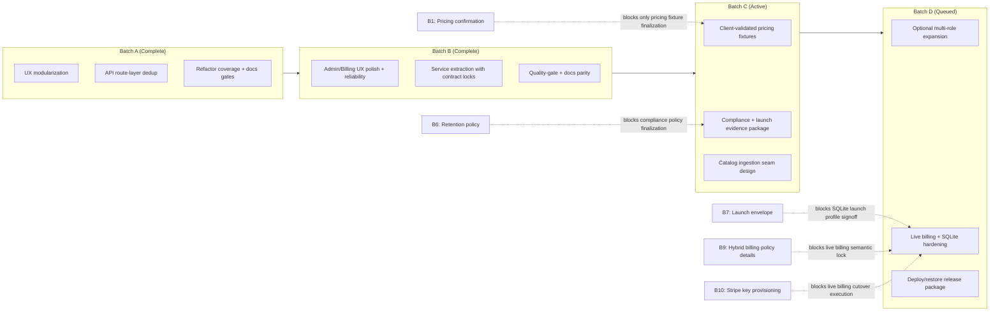

# Blockers and Roadmap Tracker

Last updated: February 24, 2026

## Current Delivery State

- Local demo product: functionally complete for core workflows.
- Production hardening: Batch B non-blocked scope complete; remaining completion gates are blocker-linked or live-integration cutover tasks.
- Outside-blocker completion score: 100% (see `docs/NON_BLOCKER_COMPLETION.md`).

## Execution Model (Parallel Batches)

Roadmap execution is intentionally batched for rapid progress:
1. Batch length: 2-3 working days.
2. Each batch ships at least one deliverable in each stream:
   - Product/UX stream
   - Domain/API stream
   - Quality/Ops stream
3. End-of-batch gate: backend tests + web tests + e2e + docs sync checks all green.
4. External blockers are isolated to affected items; other stream items continue in the same batch.

## Blockers (External)

| ID | Blocker | Why it matters | Status |
|---|---|---|---|
| B0 | OpenRouter key/network availability | LLM demo workflows are OpenRouter-required and fail-loud | Resolved (project-managed key active for prototype/demo) |
| B1 | Pricing precedence confirmation from client | Prevents pricing-engine rework risk | Open |
| B2 | Legacy migration dataset package | Optional-only for future migration track | Resolved (not required for prototype scope) |
| B3 | Launch account model (single vs org/team) | Sets tenancy/auth scope | Resolved (single-user launch) |
| B4 | Launch billing model confirmation | Defines billing semantics | Resolved (hybrid: `$1200/year` + `$10` per real-time pricing run) |
| B5 | Proposal branding/legal copy package | Needed for customer-facing proposal content | Resolved for prototype (neutral/default content approved) |
| B6 | Audit/data retention policy value confirmation | Retention controls are implemented; production policy values + export/deletion constraints still need signoff | Open |
| B7 | Launch concurrency/operating envelope | Needed to finalize production SQLite operating profile | Open |
| B8 | Legacy credential-rotation written confirmation | Needed to close known legacy security risk in launch evidence | Open |
| B9 | Hybrid billing policy details (`$10` trigger/retry/reversal + cancel timing rules) | Needed to finalize live billing adapter semantics | Open |
| B10 | Stripe account ownership + key/webhook provisioning window | Needed to schedule and execute live billing cutover safely | Open |

## Active Assumptions While Blocked

1. Pricing: current deterministic order remains active until validated against legacy samples.
2. Migration: no legacy data import is required for prototype completion.
3. Identity: single-user launch scope is fixed; multi-role/team remains post-prototype.
4. Billing: hybrid pricing model is active (`$1200/year` + `$10` real-time pricing event); local simulation remains canonical until live billing cutover.
5. Proposal output: neutral template text remains active for this prototype phase.
6. Catalog data: prototype records + admin-managed catalog entries are canonical until scraping phase.
7. LLM: OpenRouter remains required; no local fallback mode is used.

Client unblocker source:
- `CLIENT_UNBLOCKER_LETTER.md` is the authoritative request packet for pending inputs.

## Active and Queued Batches

### Batch A (complete)
- Product/UX: modularization of UI action/state flows completed.
- Domain/API: route-layer/domain extraction baseline completed.
- Quality/Ops: quality-gate enforcement and docs-contract checks completed.
- Delivery artifacts: `docs/BATCH_A_TASKBOARD.md`, `docs/BATCH_A_DEMO_NOTE.md`.

### Batch B (complete)
- Product/UX: walkthrough-focused polish for admin and billing flows (clear states, zero raw dumps, predictable actions).
- Domain/API: keep service-layer extraction progressing in small slices with contract tests protecting behavior.
- Quality/Ops: maintain green quality gate, add regression tests for every behavior-affecting refactor, and keep docs in sync.
- Execution board: `docs/BATCH_B_TASKBOARD.md`.

### Batch C (active)
- Product/UX: catalog management UX polish and clear hybrid-billing event visibility.
- Domain/API: implement client-validated pricing fixtures and fixture-based acceptance tests.
- Quality/Ops: finalize compliance policy wiring and launch evidence package.
- Domain/API: prepare post-prototype catalog-ingestion interface seams.

### Batch D (queued)
- Product/UX: optional post-prototype multi-role/admin expansion (only if scope changes).
- Domain/API: live billing provider integration and advanced SQLite production hardening.
- Quality/Ops: deployment hardening checklist, restore-drill artifacts, and release readiness evidence.

## Internal Completion Checklist

### Completed
- [x] Full web UI workflow coverage for demo scope
- [x] Deterministic pricing and Decimal handling
- [x] Billing simulation + idempotency checks
- [x] OpenRouter-required LLM implementation (fail-loud)
- [x] Admin reset and operational controls
- [x] Signed session-token auth path
- [x] RBAC baseline (admin reads via admin-role session or admin key; reset key-gated)
- [x] Password/security hardening (PBKDF2, secret checks)
- [x] Path write restrictions for export endpoints
- [x] Request tracing (`X-Request-ID`) + structured API request logging
- [x] Config-driven API rate limiting (public/auth buckets)
- [x] Billing simulation lifecycle transition validation
- [x] Launch evidence checklist mapped to tests/artifacts
- [x] SQLite operations runbook + maintenance command coverage
- [x] Production auth default guards validated (session secret/admin key/legacy header defaults)
- [x] Deployment hardening checklist package
- [x] Admin user metadata enrichment (counts + last login/activity visibility)
- [x] Provider-driven billing runtime seam with fail-loud stripe path
- [x] One-command release evidence bundle generation (`scripts/capture_release_evidence.sh`)

### Remaining (Post-blocker / Production-focused)
- [ ] Client-validated pricing fixtures
- [ ] Live billing provider integration
- [ ] Hybrid billing policy detail lock (event triggers, retries, reversals)
- [ ] Compliance retention policy value/signoff and export/deletion constraints
- [ ] Launch concurrency envelope validation for SQLite settings (probe tooling is ready; pending client expected traffic profile)
- [ ] Legacy credential-rotation confirmation archived in launch evidence

## Roadmap Visualization

## Batch Planning Template

1. Select one deliverable per stream (UX, API, Ops) for the next 2-3 day batch.
2. Mark any blocker-linked item as "assumption mode" or "blocked".
3. Keep WIP under limits and avoid opening new items before closing current batch items.
4. Run full quality gate at batch close and publish a short demo/change note.
